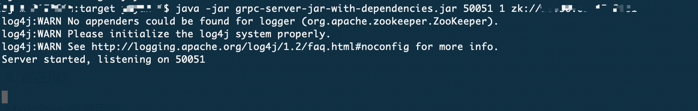
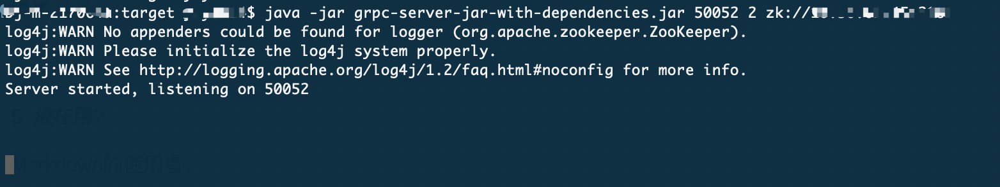
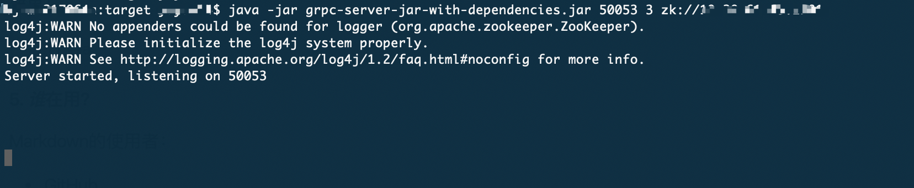
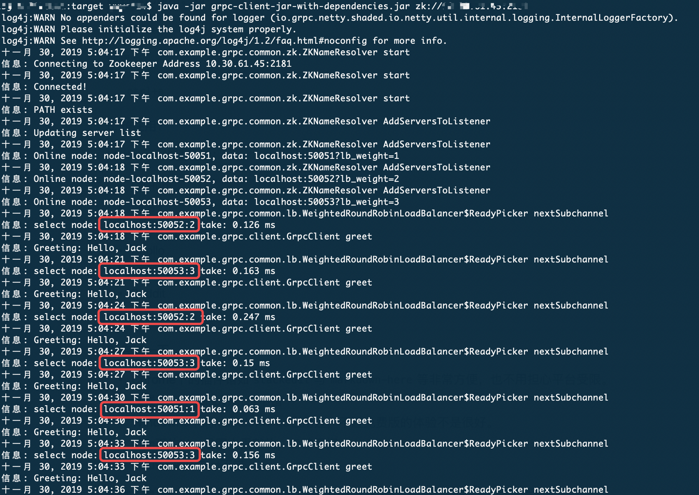

### grpc + zookeeper 实现自定义grpc负载均衡策略 

#### 一、背景介绍 
````
gRPC官方没有直接提供服务注册与发现的实现，但其设计文档已提供实现的思路，并在不同语言的gRPC代码API中已提供了命名解析和负载均衡接口供扩展。  
此外，gRPC client侧官方提供的负载均衡策略只有无负载均衡策略和轮训策略，因此实现一种加权轮训的gRPC负载均衡策略。

基本实现原理：  
1. server端启动后，向指定的zk注册自己，同时将ip、端口和lb权值保存到节点中；  
2. client端启动后，向命名服务器发出名称解析请求，名称将解析为一个或多个IP地址，每个IP地址标示它是服务器地址还是负载均衡器地址，以及标示要使用那个客户端负载均衡策略或服务配置。  
3. 客户端实例化负载均衡策略，如果解析返回的地址是负载均衡器地址，则客户端将使用grpclb策略，否则客户端使用服务配置请求的负载均衡策略；  
4. 负载均衡策略为每个服务器地址创建一个子通道（channel）；   
5. 当有rpc请求时，负载均衡策略决定那个子通道即grpc server将接收请求，当可用服务器为空时客户端的请求将被阻塞。
````

#### 二、模块说明
````
grpc-lb
├── common         公共代码，包括zk，protobuf文件，和基于加权轮训的lb策略实现
├── grpc-client    一个简单的grpc client，lb策略的使用者
└── grpc-server    一个简单的grpc server
````
#### 三、运行指导
1. 进入工程目录，执行
   >mvn clean package  
2. 启动grpc server，进入grpc-server/target下，执行：   
   >java -jar grpc-server-jar-with-dependencies.jar PORT LB_WEUGHT ZK_ADDRESS  
                 
    可以多启动几个server以便得到测试效果  
3. 启动grpc client，进入grpc-client/target目录下，执行：  
    >java -jar grpc-client-jar-with-dependencies.jar ZK_ADDRESS  

#### 四、效果展示
分别启动三个server，运行的端口号及lb weight为50051 1、50052 2和50053 3。  
按照加权轮训的调度策略，6次请求中，50051需要接收到1次，50052需要接收到2次，50053需要接收到三次。  
三台server启动  
* 50051  


* 50052  


* 50053  


client运行效果 
 
可以看到50051、50052和50053分别调度到了1、2、3次  
